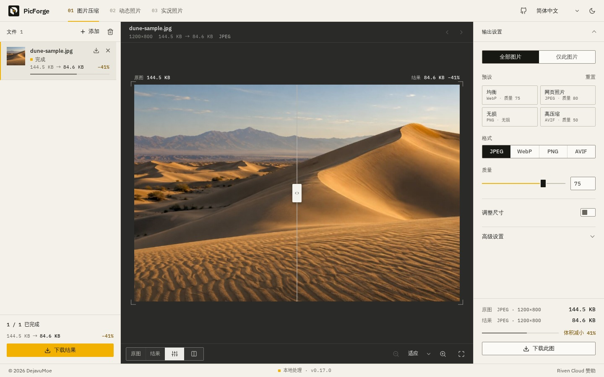
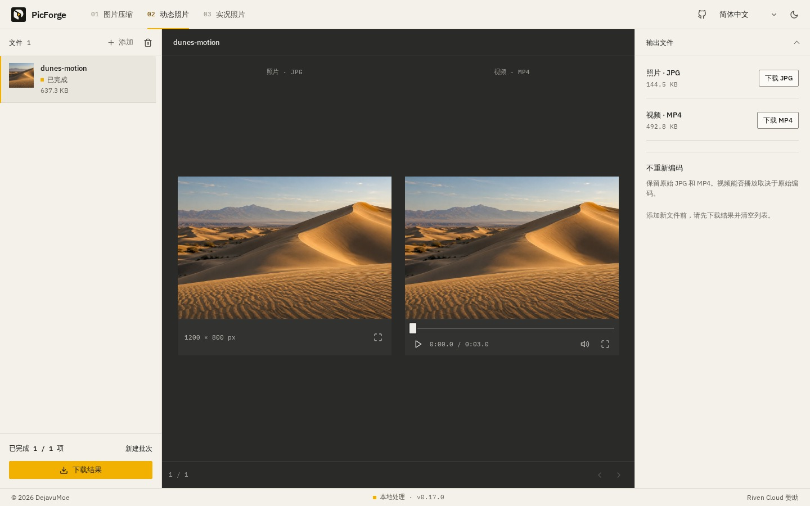
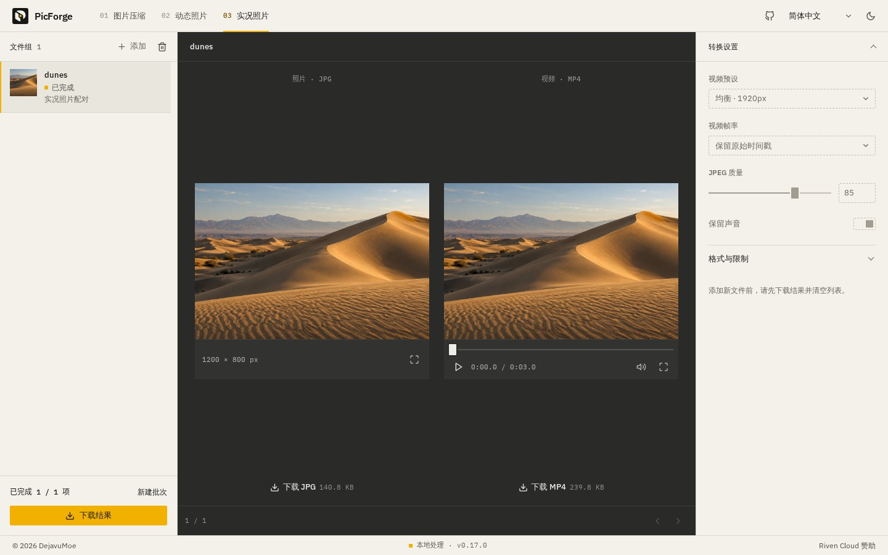

# PicForge

压缩图片、拆分 Android 动态照片、转换 iOS 实况照片。一个在浏览器里运行的开源工具箱，文件始终留在你的设备上。

[打开 PicForge](https://picforge.de) · [English](../../README.md) · **简体中文** · [繁體中文](README.zh-TW.md) · [日本語](README.ja.md) · [한국어](README.ko.md)



*当前界面的实际截图，使用项目自带的沙丘生成示例图。图中大小来自本次处理结果，不代表通用压缩表现。*

## 三个工具

| 工具 | 用途 | 导出 |
| --- | --- | --- |
| **图片压缩** | 批量压缩、转换格式和调整尺寸。接受 JPEG、PNG、WebP、AVIF、GIF、APNG、BMP 和 SVG，具体取决于浏览器的解码支持。 | JPEG、WebP、PNG 或 AVIF；动画仅限 WebP |
| **Android 动态照片** | 将末尾附带视频的 JPG 拆成原始照片和视频，不重新编码。 | 原始 JPG + MP4 |
| **iOS 实况照片** | 按 Apple 实况照片标识配对 HEIC/HEIF 与 MOV（文件缺少标识时按文件名），转成便于分享的格式。也可单独处理照片或视频，并接受 JPEG、MP4 输入。 | JPEG + H.264 MP4，可保留音频并转为 AAC |

### 图片压缩

- **调色与滤镜：** 在右侧「调色与滤镜」中选择原图、鲜艳、暖阳、冷调、复古、胶片、黑白或褪色效果，调整滤镜强度。支持曝光、鲜明度、亮度、对比度、高光、阴影、白色、黑色、饱和度、自然饱和度、色温、色调、锐化和暗角。效果会写入 JPEG/WebP/PNG/AVIF 导出图片与 ZIP 设置清单。支持整批调整和单张独立调整；「重置调色」保留导出设置。动画需使用中性调色设置，避免丢失动画帧。见[调色说明](../color-adjustments.md)。
- **圆形局部选区：** 拖动圆形选区移动、缩放，调整边缘羽化，并选择圈内或圈外调色。所有滤镜和调色参数均可用于当前图片的独立局部调整，选区辅助线不会写入导出图片。

拖入图片、从剪贴板粘贴，或在首页打开示例图。添加文件或修改设置后，图片会自动处理。

- 拖动滑杆或并排对比原图与结果，放大或全屏检查细节。
- 为全部图片设置参数，也可单独设置某张图片。之后修改全局参数，不会覆盖单图设置。
- 按像素或百分比缩放。「适应边界」保持比例且不放大；「居中裁切」填满指定尺寸；「拉伸」使用精确宽高。
- PNG 输出为无损压缩，不使用质量滑块。
- GIF/APNG 动画可导出为[动画 WebP](../animation-pipeline.md)。动画不支持 JPEG/PNG/AVIF 输出，选择这些格式会提示设置错误，不会静默导出首帧。

### 动态照片与实况照片

添加原片，确认队列后开始批量处理。任务依次执行，支持取消和重试。照片与视频可并排预览、分别下载，也可将已完成的结果打包成带清单的 ZIP。

Android 拆分保留原始字节。iOS 转换会处理显示裁切和旋转，默认保留视频原始时间戳，也可选择固定 30 fps。

<details>
<summary>查看两个媒体工具的实际界面</summary>

**Android 动态照片**



**iOS 实况照片**



演示文件由同一张沙丘生成图合成，截图展示真实拆分和转换结果，不作为相机兼容性测试。见[图片来源说明](../assets/readme/README.md)。

</details>

## 文件如何处理

所有处理都在本地完成，无需账号、上传文件、处理服务器或 API 密钥。PicForge 没有遥测；浏览器只需下载应用和所需引擎。

| 路径 | 处理过程 |
| --- | --- |
| 图片 | Compat 通常在编码 Worker 内用 `createImageBitmap` 和 OffscreenCanvas 解码、缩放原始 Blob，再调用 `@jsquash/*` 编码。SVG 或 Worker 无法解码的文件回退到主线程 Canvas。 |
| Android | 验证内嵌 MP4 结构，再按字节范围拆出原始 JPG 和 MP4。 |
| iOS | 按 Apple 实况照片标识配对，否则按同名文件分组。HEIC 在结果可校验时由浏览器解码（Safari），否则由 libheif 解码；支持的颜色配置转换到 sRGB 后由 MozJPEG 编码。符合条件且保留源时间戳的视频使用 WebCodecs；PCM 音频交由 FFmpeg，视频不支持或失败时也回退到 FFmpeg。固定 30 fps 使用 FFmpeg。 |

下载前，结果保存在浏览器内存中。切换工具、返回首页或使用浏览器前进／后退，都保留当前队列。**刷新或关闭页面会清除文件和结果，请先下载。**

## 使用前了解

- **两个文件都带 Apple 标识时会校验标识**，没有标识的文件只按文件名配对。请保留原片：导出用于分享，不是 HEIC 的 HDR、元数据和辅助图像归档。支持的 HEIC 颜色配置转为 sRGB，仅含 LUT 的 RGB 配置会嵌入 JPEG。
- **支持情况取决于浏览器。** 图片解码和视频预览受浏览器及编码格式影响；提取的视频即使不能预览，仍可下载。大文件可能触及内存或大小限制。
- **离线使用需要先加载。** 应用可从缓存运行，转换引擎也必须先成功加载并缓存；首次转换可能需要联网。

界面支持英语、简体中文、繁体中文、日语和韩语，并提供明暗主题。未手动选择时，语言跟随浏览器，主题跟随系统。

## 本地运行

需要 **Node.js 22.13+ (22.x) / 24+** 和 **pnpm 11.8.x**。

固定版本的 HEIC 模块和 WASM 已作为[项目静态资源](../heif-build.md)提供。日常开发和 CI 不需要 Emscripten，也不需要单独编译解码器。

```sh
git clone https://github.com/DejavuMoe/PicForge.git
cd PicForge
pnpm install
pnpm dev
```

打开 [127.0.0.1:5173](http://127.0.0.1:5173)。`pnpm build` 构建，`pnpm preview` 预览。开发和构建命令会准备由项目自身托管的 `/wasm/` 编解码资源；构建时还会生成 Service Worker 使用的资源清单。

## 技术栈与开发

| 部分 | 技术 |
| --- | --- |
| 界面 | React 19、TypeScript、Vite 8、原生 CSS |
| 状态与多语言 | Zustand、i18next |
| 媒体处理 | Canvas、Web Workers、WebCodecs、WebAssembly、`@jsquash/*`、libheif、FFmpeg |
| 下载与离线 | JSZip、Service Worker |

`packages/app` 包含界面和媒体工具，`packages/worker` 负责图片处理与 Worker，`packages/codecs` 提供编码器适配和参数定义。压缩使用 **Compat** 引擎。

修改后运行：

```sh
pnpm lint
pnpm typecheck
pnpm test
pnpm test:heif
pnpm test:build
pnpm build
```

开发与维护见[文档索引](../README.md)、[项目架构](../architecture.md)、[验证指南](../validation.md)、[QA 清单](../QA_CHECKLIST.md)和 [UI 设计](../UI_DESIGN.md)。Playwright WebKit 通过不等于已验证真实 Safari 或 iPhone。

欢迎提交问题和补丁。反馈时请附上浏览器、复现步骤、文件格式和相关设置。请勿在 Issue 或提交中放入私人照片，尽量使用非私人样本复现。

## 开源许可

应用代码采用 [MIT](../../LICENSE)。媒体组件使用各自的许可，包括 [GPL FFmpeg](../../packages/app/public/licenses/FFmpeg-GPL-2.0.txt) 和 [LGPL libheif](../../packages/app/public/licenses/libheif-LGPL-3.0.txt)。组件署名（含 MotionFlow）见 [NOTICE.txt](../../packages/app/public/licenses/NOTICE.txt)。

分发编解码器二进制时，还需履行相应的源码提供义务。应用的 MIT 许可不会替代这些组件的许可。
