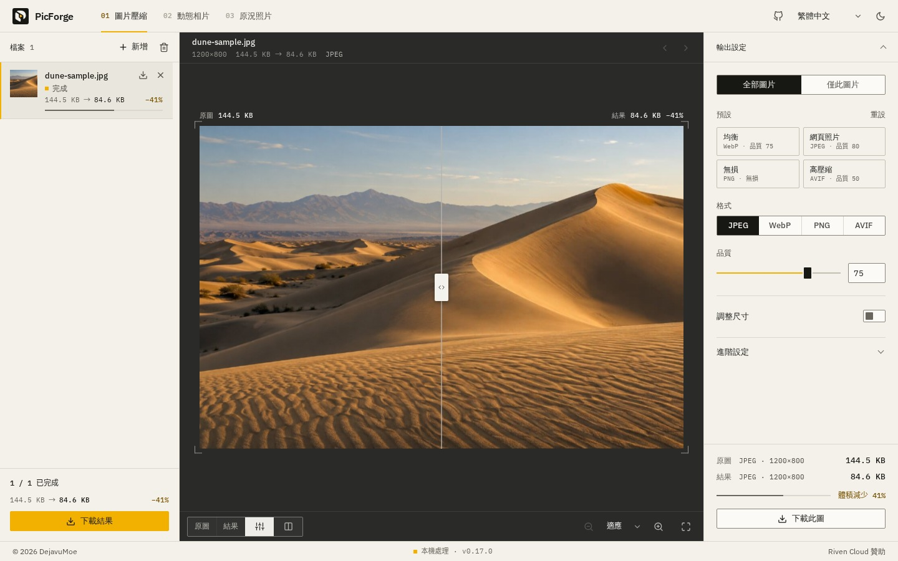
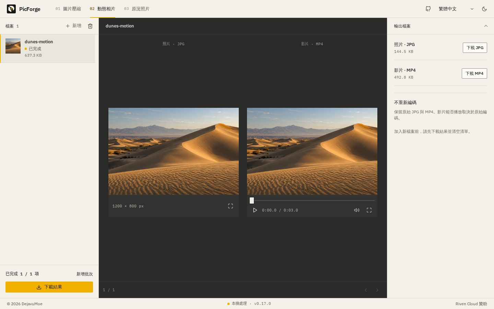
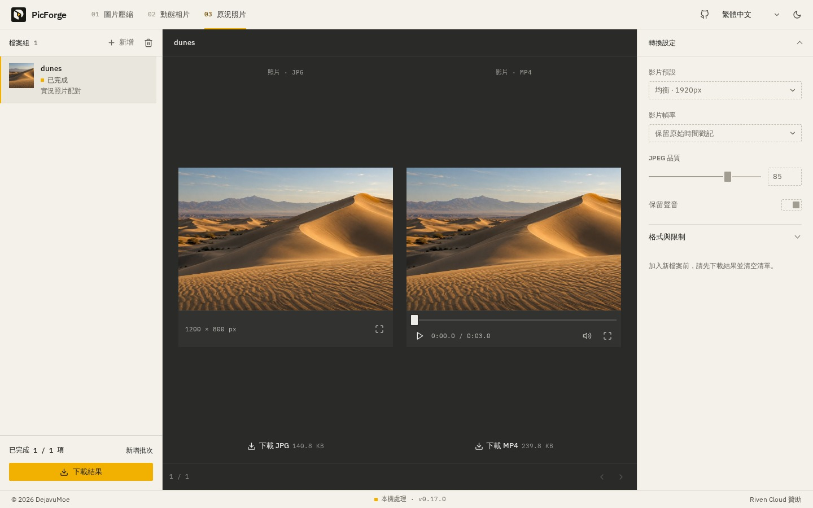

# PicForge

壓縮圖片、拆分 Android 動態相片、轉換 iOS 原況照片。在瀏覽器裡執行的開源工具箱，檔案始終留在你的裝置上。

[開啟 PicForge](https://picforge.de) · [English](../../README.md) · [简体中文](README.zh-CN.md) · **繁體中文** · [日本語](README.ja.md) · [한국어](README.ko.md)



*目前介面的實際截圖，使用專案內附的沙丘生成範例圖。圖中的檔案大小來自這次處理，不代表所有圖片的壓縮效果。*

## 三個工具

| 工具 | 用途 | 匯出 |
| --- | --- | --- |
| **圖片壓縮** | 批次壓縮、轉換格式及調整尺寸。接受 JPEG、PNG、WebP、AVIF、GIF、APNG、BMP 和 SVG，實際支援依瀏覽器的解碼能力而定。 | JPEG、WebP、PNG 或 AVIF；動畫僅限 WebP |
| **Android 動態相片** | 將尾端附有影片的 JPG 拆成原始相片與影片，不重新編碼。 | 原始 JPG + MP4 |
| **iOS 原況照片** | 依 Apple 原況照片識別碼配對 HEIC/HEIF 與 MOV（檔案缺少識別碼時依檔名），轉成適合分享的格式。也可單獨處理相片或影片，並接受 JPEG、MP4 輸入。 | JPEG + H.264 MP4，可保留音訊並轉為 AAC |

### 圖片壓縮

拖入圖片、從剪貼簿貼上，或在首頁開啟範例圖。新增檔案或變更設定後，圖片會自動處理。

- 拖動滑桿或並排比較原圖與結果，放大或全螢幕查看細節。
- 為全部圖片設定參數，也可單獨設定某張圖片。之後修改全域參數，不會覆蓋單張設定。
- 依像素或百分比縮放。符合邊界時維持比例且不放大；置中裁切填滿指定尺寸；拉伸則使用精確寬高。
- PNG 輸出採無損壓縮，不使用品質滑桿。
- GIF/APNG 動畫可匯出為[動畫 WebP](../animation-pipeline.md)。動畫不支援 JPEG/PNG/AVIF 輸出，選擇這些格式會提示設定錯誤，不會默默只匯出首幀。

### 動態相片與原況照片

加入原始檔、確認佇列後，開始批次處理。工作依序執行，支援取消與重試。相片和影片可並排預覽、分別下載，也可將已完成的結果打包成附清單的 ZIP。

Android 拆分保留原始位元組。iOS 轉換會處理顯示裁切與旋轉，預設保留影片原始時間戳記，也可選擇固定 30 fps。

<details>
<summary>查看兩個媒體工具的實際介面</summary>

**Android 動態相片**



**iOS 原況照片**



示範檔案由同一張沙丘生成圖合成，截圖呈現實際拆分與轉換結果，不作為相機相容性測試。見[圖片來源說明](../assets/readme/README.md)。

</details>

## 檔案如何處理

所有處理都在本機完成，不需帳號、上傳檔案、處理伺服器或 API 金鑰。PicForge 沒有遙測；瀏覽器只需下載應用程式和所需引擎。

| 路徑 | 處理過程 |
| --- | --- |
| 圖片 | Compat 通常在編碼 Worker 內以 `createImageBitmap` 和 OffscreenCanvas 解碼、縮放原始 Blob，再呼叫 `@jsquash/*` 編碼。SVG 或 Worker 無法解碼的檔案回退至主執行緒 Canvas。 |
| Android | 驗證內嵌 MP4 結構，再依位元組範圍拆出原始 JPG 與 MP4。 |
| iOS | 依 Apple 原況照片識別碼配對，否則依同名檔案分組。HEIC 在結果可校驗時由瀏覽器解碼（Safari），否則由 libheif 解碼；支援的色彩描述轉換為 sRGB 後由 MozJPEG 編碼。符合條件且保留來源時間戳的影片使用 WebCodecs；PCM 音訊交由 FFmpeg，影片不支援或失敗時也回退至 FFmpeg。固定 30 fps 使用 FFmpeg。 |

下載前，結果保存在瀏覽器記憶體中。切換工具、返回首頁或使用瀏覽器上一頁／下一頁，都會保留目前佇列。**重新整理或關閉頁面會清除檔案與結果，請先下載。**

## 使用前須知

- **兩個檔案都帶 Apple 識別碼時會校驗識別碼**，沒有識別碼的檔案只依檔名配對。請保留原始檔：匯出用於分享，並非 HEIC 的 HDR、中繼資料及輔助影像封存。支援的 HEIC 色彩描述轉為 sRGB，僅含 LUT 的 RGB 描述會嵌入 JPEG。
- **支援程度依瀏覽器而異。** 圖片解碼和影片預覽受瀏覽器及編碼格式影響；擷取的影片即使無法預覽，仍可下載。大型檔案可能超出記憶體或大小限制。
- **離線使用前須先載入。** 應用程式可從快取執行，轉換引擎也必須先成功載入並快取；首次轉換可能需要網路連線。

介面支援英語、簡體中文、繁體中文、日語及韓語，並提供明暗主題。尚未手動選擇時，語言依瀏覽器設定，主題依系統設定。

## 本機執行

需要 **Node.js 22.13+ (22.x) / 24+** 和 **pnpm 11.8.x**。

固定版本的 HEIC 模組和 WASM 已作為[專案靜態資源](../heif-build.md)提供。日常開發及 CI 不需要 Emscripten，也不必另行編譯解碼器。

```sh
git clone https://github.com/DejavuMoe/PicForge.git
cd PicForge
pnpm install
pnpm dev
```

開啟 [127.0.0.1:5173](http://127.0.0.1:5173)。`pnpm build` 建置，`pnpm preview` 預覽。開發和建置命令會準備由專案自行託管的 `/wasm/` 編解碼資源；建置時也會產生 Service Worker 使用的資源清單。

## 技術與開發

| 部分 | 技術 |
| --- | --- |
| 介面 | React 19、TypeScript、Vite 8、原生 CSS |
| 狀態與多語言 | Zustand、i18next |
| 媒體處理 | Canvas、Web Workers、WebCodecs、WebAssembly、`@jsquash/*`、libheif、FFmpeg |
| 下載與離線 | JSZip、Service Worker |

`packages/app` 包含介面和媒體工具，`packages/worker` 負責圖片處理與 Worker，`packages/codecs` 提供編碼器介接及參數定義。壓縮使用 **Compat** 引擎。

修改後執行：

```sh
pnpm lint
pnpm typecheck
pnpm test
pnpm test:heif
pnpm test:build
pnpm build
```

開發與維護見[文件索引](../README.md)、[專案架構](../architecture.md)、[驗證指南](../validation.md)、[QA 清單](../QA_CHECKLIST.md)和 [UI 設計](../UI_DESIGN.md)。Playwright WebKit 通過不代表已驗證實際 Safari 或 iPhone。

歡迎回報問題與提交修補。請附上瀏覽器、重現步驟、檔案格式及相關設定。請勿在 Issue 或提交中加入私人相片，盡量使用非私人範例重現。

## 開源授權

應用程式碼採用 [MIT](../../LICENSE)。媒體元件使用各自的授權，包括 [GPL FFmpeg](../../packages/app/public/licenses/FFmpeg-GPL-2.0.txt) 和 [LGPL libheif](../../packages/app/public/licenses/libheif-LGPL-3.0.txt)。元件署名（含 MotionFlow）見 [NOTICE.txt](../../packages/app/public/licenses/NOTICE.txt)。

散布編解碼器二進位檔時，仍須履行相應的原始碼提供義務。應用程式的 MIT 授權不會取代這些元件的授權。
